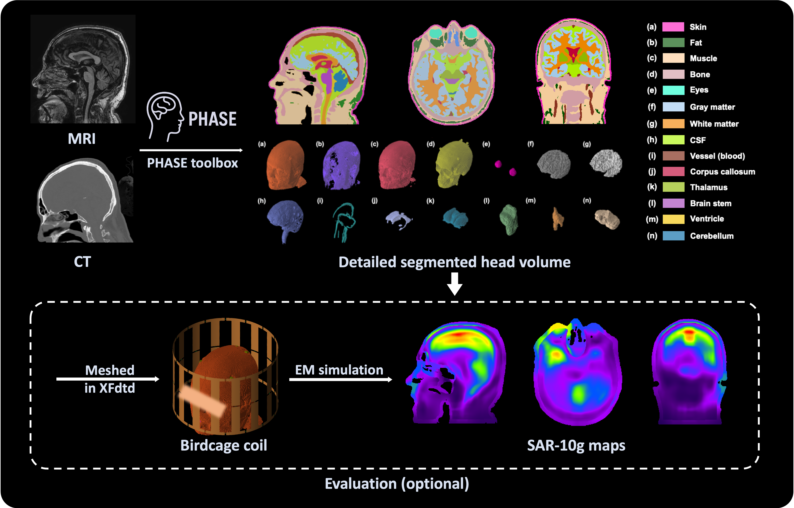

# PHASE
PHASE: Personalized Head-based Automatic Simulation for Electromagnetic Properties in 7T MRI

# Abstract
Accurate and individualized human head models are becoming increasingly important for electromagnetic (EM) simulations. These simulations depend on precise anatomical representations to realistically model electric and magnetic field distributions, particularly when evaluating Specific Absorption Rate (SAR) within safety guidelines. We introduce Personalized Head-based Automatic Simulation for EM properties (PHASE), an automated open-source toolbox that generates high-resolution, patient-specific head models for EM simulations using paired T1-weighted (T1w) magnetic resonance imaging (MRI) and computed tomography (CT) scans with 13 tissue labels. To evaluate the performance of PHASE models, we conduct semi-automated segmentation and EM simulations on 15 real human patients, serving as the gold standard reference. The PHASE model achieved comparable global SAR and localized SAR averaged over 10 grams of tissue (SAR-10g), demonstrating its potential as a promising tool for generating large-scale human model datasets in the future.
